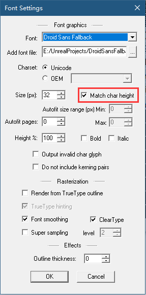
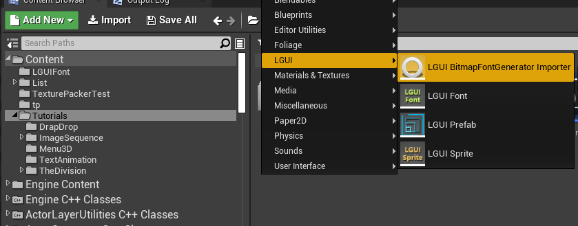
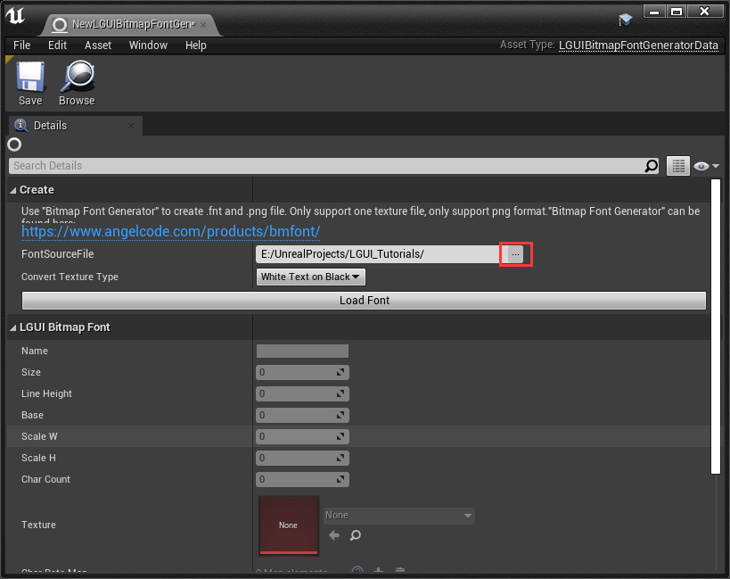
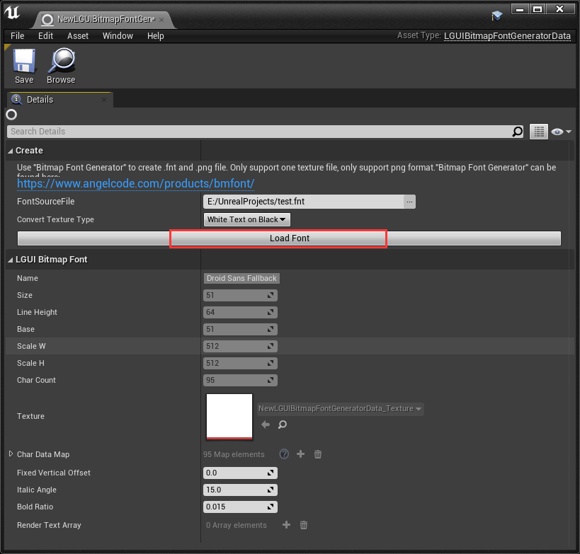

[English](./README_en.md)  
#BitmapFontGenerator importer for LGUI UE4
---
**这是LGUI插件的一个扩展插件，需要LGUI 2.13.1及以上版本.**  
此插件可以让LGUI导入[BitmapFontGenerator](https://www.angelcode.com/products/bmfont/)生成的文字图集，并在LGUI里当作font data来用, 只支持每个字体一张贴图.  
Tutorial video : [Bilibili](https://www.bilibili.com/video/BV11y4y1T75c/)  [Youtube](https://youtu.be/zt6S22_pm1g)  
### 在BitmapFontGenerator中按照下图设置：
Font Settings:  
   
Export Settings:  
   
### 在UE4和LGUI中按照下面步骤：  
#### 1.  
右键点击ContentBrowser空白处，选择**LGUI BitmapFontGenerator Importer**来创建个导入数据.  
(注意：根据UE4加载插件的顺序，有时候*LGUI BitmapFontGenerator Importer*会出现在"LGUI"分栏里或"Miscellaneous"分栏里).  

#### 2.  
双击打开刚才创建的*LGUI BitmapFontGenerator Importer*，点击"FontSourceFile"后面的"..."按钮，选择*BitmapFontGenerator*导出的fnt文件.  

#### 3.  
点击"Load Font"按钮.  

