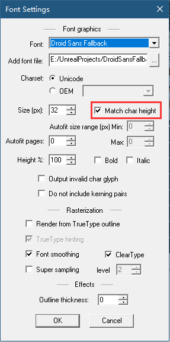
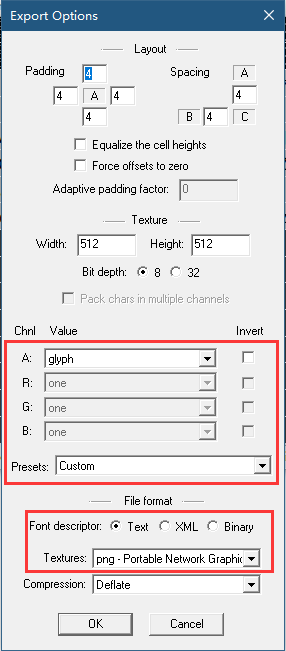
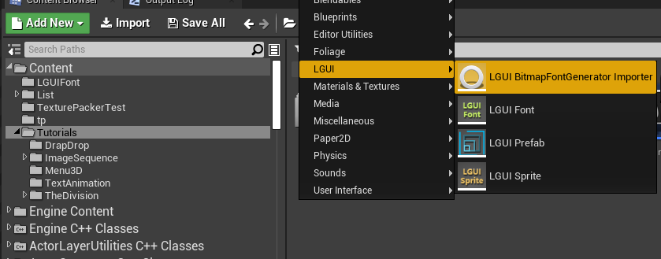
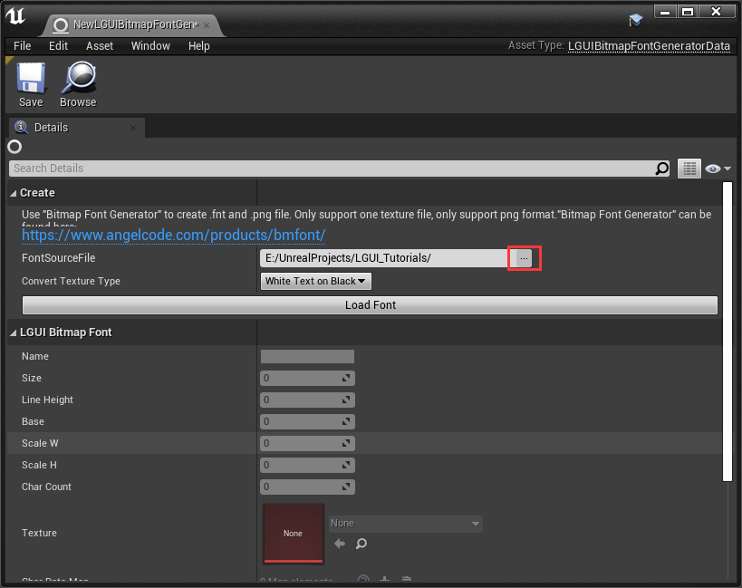
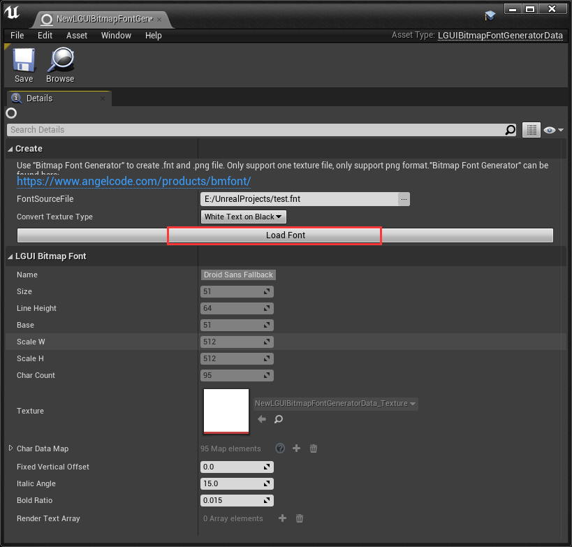

[中文](./README.md)  
#BitmapFontGenerator importer for LGUI UE4
---
**This is a LGUI's extension plugin, need LGUI version 2.13.1 and upward.**  
This plugin allows us to import font generated from [BitmapFontGenerator](https://www.angelcode.com/products/bmfont/) as LGUI's font data, only support one texture file for one font.  
### For BitmapFontGenerator's settins, follow the image below:  
Font Settings:  
   
Export Settings:  
   
### In UE4 LGUI follow these steps:  
#### 1.  
Right click in ContentBrowser and select **LGUI BitmapFontGenerator Importer** to create a importer data.  
(Note: Sometimes the *LGUI TexturePacker Importer* may appear inside "LGUI" category or "Miscellaneous" category, depends on what order UE4 loads plugins).  

#### 2.  
Double click to open it, click the button "..." after the "FontSourceFile", then select a *BitmapFontGenerator* exported fnt file.  

#### 3.  
Click "Load Font" button.  

